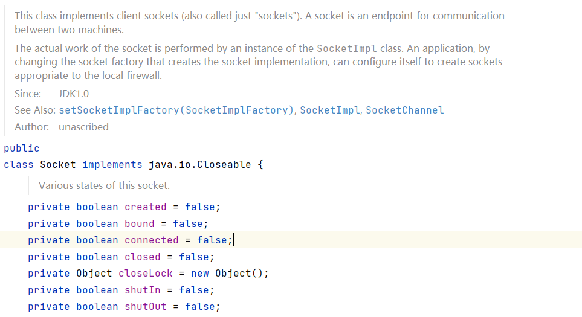
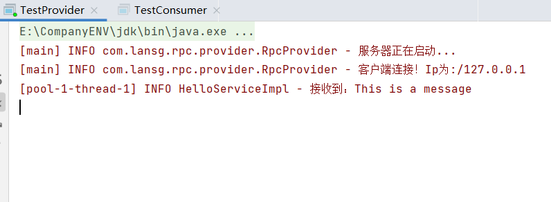
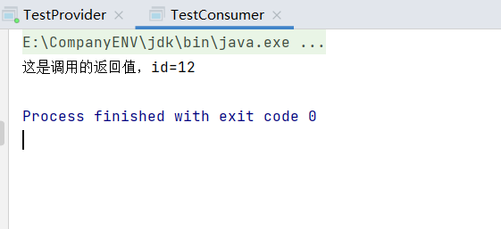

### 实现思路

首先我们需要搞清楚RPC的大致原理是怎样的。provider暴露出服务的接口，consumer发现并调用该接口，并通过网络将接口的一些相关信息（调用的接口名，参数列表和参数类型等）传输给provider，provider找到该接口的具体实现类，执行相关方法后将结果作为返回值返回给consumer。

接下来将从以下几个方面入手，实现一个简单的RPC。


#### 服务接口

由于方法的重载，provider可能会存在许多重名的方法，为了准确调用到我们需要的方法，provider端需要将方法的名称和参数等信息都发送给provider。

服务接口我们称为`HelloService`：

```java
public interface HelloService {
    String hello(HelloObject object);
}
```

hello方法需要传递一个对象，HelloObject对象，定义如下：

```java
@Data
@AllArgsConstructor
public class HelloObject implements Serializable {
    private Integer id;
    private String message;
}
```

注意这个对象需要实现`Serializable`接口，因为它需要在调用过程中从客户端传递给服务端。

接着我们在服务端对这个接口进行实现，实现的方式也很简单，返回一个字符串就行：

```java
@Slf4j
public class HelloServiceImpl implements HelloService {
    @Override
    public String hello(HelloObject obj) {
        log.info("接收到消息:{}",obj.getMessage());
        return "这是调用的返回值,id="+obj.getId();
    }
}
```


#### 传输协议

consumer在调用服务接口并向provider传递信息时，双方应当规定一种传递信息的方式，不然provider就无法对信息进行识别了。我们可以将接口名称，参数列表等信息写到一个对象里，传输时只需传递此对象就可以了。

```java
@Data
@Builder
public class RpcRequestBean implements Serializable {
    //待调用接口名称
    private String interfaceName;

    //待调用方法名称
    private String methodName;

    //调用方法参数列表
    private Object[] parameters;

    //调用方法的参数类型
    private Class<?>[] paramTypes;
}
```

同理，provider给consumer返回信息时，也可以封装为一个对象。

```java
@Data
public class RpcResponseBean<T> implements Serializable {
    //响应状态码
    private Integer code;

    //响应数据
    private T data;

    //补充信息
    private String message;

    public static <T> RpcResponseBean<T> success(T data){
        RpcResponseBean<T> response=new RpcResponseBean<>();
        response.setCode(ResponseCode.SUCCESS.getCode());
        response.setData(data);
        return response;
    }
    public static <T> RpcResponseBean<T> fail(ResponseCode code){
        RpcResponseBean<T> response=new RpcResponseBean<>();
        response.setCode(code.getCode());
        response.setMessage(code.getMessage());
        return  response;
    }
}
```


#### consumer实现-动态代理

由于在客户端这一侧我们并没有接口的具体实现类，就没有办法直接生成实例对象（需要实例对象是因为我们**需要通过对象来调用接口中的方法**，见下文`TestConsumer`）。这时，我们可以通过动态代理的方式生成实例，并且调用方法时生成需要的RpcRequestBean对象并且发送给服务端。

这里我们采用JDK动态代理，代理类是需要实现`InvocationHandler`接口的。

通过getProxy()方法来生成代理对象，`InvocationHandler`接口需要实现invoke()方法，来**指明代理对象的方法被调用时的动作**。这里的动作就是生成一个RpcRequest对象，发送出去，然后返回从服务端接收到的结果即可。

RpcRequest可以使用Builder模式来生成这个对象。发送的逻辑通过一个RpcConsumer对象来实现，这个对象的作用，就是将一个对象发过去，并且接受返回的对象。

```java
public class RpcConsumerProxy implements InvocationHandler {
    private String host;
    private int port;

    public RpcConsumerProxy(String host, int port) {
        this.host = host;
        this.port = port;
    }

    //@SuppressWarnings用来取消Java编译器发出的警告，避免警告过于繁杂。
    @SuppressWarnings("unchecked")
    public <T> T getProxy(Class<T> clazz) {
        return (T) Proxy.newProxyInstance(clazz.getClassLoader(), new Class<?>[]{clazz}, this);
    }

    @Override
    public Object invoke(Object proxy, Method method, Object[] args) throws Throwable {
        RpcRequestBean rpcRequest = RpcRequestBean.builder()
                .interfaceName(method.getDeclaringClass().getName())
                .methodName(method.getName())
                .parameters(args)
                .paramTypes(method.getParameterTypes())
                .build();
        RpcConsumer rpcConsumer = new RpcConsumer();
        return ((RpcResponseBean) rpcConsumer.sendRequest(rpcRequest, host, port)).getData();
    }
}
```

这里直接使用Java的序列化方式，通过Socket传输。创建一个Socket，获取ObjectOutputStream对象，然后把需要发送的对象传进去即可，接收时获取ObjectInputStream对象，readObject()方法就可以获得一个返回的对象。

```java
@Slf4j
public class RpcConsumer {
    public Object sendRequest(RpcRequestBean rpcRequest,String host,int port){
        try (Socket socket=new Socket(host,port)){
            ObjectOutputStream objectOutputStream=new ObjectOutputStream(socket.getOutputStream());
            ObjectInputStream objectInputStream=new ObjectInputStream(socket.getInputStream());
            objectOutputStream.writeObject(rpcRequest);
            //flush()方法用于刷新此流，并将任何缓冲输出的字节立即写入基础流。
            objectOutputStream.flush();
            return objectInputStream.readObject();
        }catch (IOException | ClassNotFoundException e){
            log.info("调用有错误发生:",e);
            return null;
        }
    }
}
```

这里使用的是try-catch的一种try-with-resources 的用法，称为 ARM (Automatic Resource Management) 自动资源管理。正常try-catch的用法中，我们使用完资源后，需要在finally中手动对资源进行关闭，但是在我们使用类似`try (Socket socket=new Socket(host,port))`后，数据流会在 try 执行完毕后自动被关闭，前提是**这些可关闭的资源必须实现 java.lang.AutoCloseable 接口**。下文出现的try（）同理。




#### provider实现-反射调用

使用一个ServerSocket监听某个端口，循环接收连接请求，如果发来了请求就创建一个线程，在新线程中处理调用，这里通过线程池来创建线程。

这里简化了一下，RpcServer暂时只能注册一个接口，即对外提供一个接口的调用服务，添加register方法，在注册完一个服务后立刻开始监听。

```java
@Slf4j
public class RpcProvider {
    private final ExecutorService threadPool;

    public RpcProvider(){
        int corePoolSize=5;
        int maximumPoolSize=50;
        long keepAliveTime=60;
        BlockingQueue<Runnable> workingQueue=new ArrayBlockingQueue<>(100);
        ThreadFactory threadFactory= Executors.defaultThreadFactory();
        threadPool=new ThreadPoolExecutor(corePoolSize,maximumPoolSize,keepAliveTime,TimeUnit.SECONDS,workingQueue,threadFactory);
    }

    public void register(Object service,int port){
        try (ServerSocket serverSocket=new ServerSocket(port)){
            log.info("服务器正在启动...");
            Socket socket;
            while ((socket = serverSocket.accept())!=null){
                log.info("客户端连接！Ip为:"+socket.getInetAddress());
                threadPool.execute(new WorkerThread(socket,service));
            }
        }catch (IOException e){
            log.info("连接时有错误发生:",e);
        }
    }
}
```

WorkerThread表示工作线程，它实现了Runnable接口，用于接收`RpcRequestBean`对象，解析并且调用，生成`RpcResponseBean`对象并传输回去。

```java
@Slf4j
public class WorkerThread implements Runnable{
    private Socket socket;
    private Object service;

    public WorkerThread(Socket socket, Object service) {
        this.socket = socket;
        this.service = service;
    }

    @Override
    public void run() {
        try (ObjectInputStream objectInputStream = new ObjectInputStream(socket.getInputStream());
             ObjectOutputStream objectOutputStream = new ObjectOutputStream(socket.getOutputStream())) {
            RpcRequestBean rpcRequest = (RpcRequestBean) objectInputStream.readObject();
            Method method = service.getClass().getMethod(rpcRequest.getMethodName(), rpcRequest.getParamTypes());
            Object returnObject = method.invoke(service, rpcRequest.getParameters());
            objectOutputStream.writeObject(RpcResponseBean.success(returnObject));
            objectOutputStream.flush();
        } catch (IOException | ClassNotFoundException | NoSuchMethodException | IllegalAccessException | InvocationTargetException e) {
            log.info("调用或发送时有错误发生：", e);
        }
    }
}
```

#### 测试

服务端：

```java
@Slf4j
public class TestProvider {
    public static void main(String[] args) {
        HelloService helloService = new HelloServiceImpl();
        RpcProvider rpcProvider = new RpcProvider();
        rpcProvider.register(helloService, 9000);
    }
}
```

客户端：

```java
public class TestConsumer {
    public static void main(String[] args) {
        RpcConsumerProxy proxy = new RpcConsumerProxy("127.0.0.1", 9000);
        HelloService helloService = proxy.getProxy(HelloService.class);
        HelloObject object = new HelloObject(12, "This is a message");
        String res = helloService.hello(object);
        System.out.println(res);
    }
}
```

先启动服务端，再启动客户端，得到结果如下：



