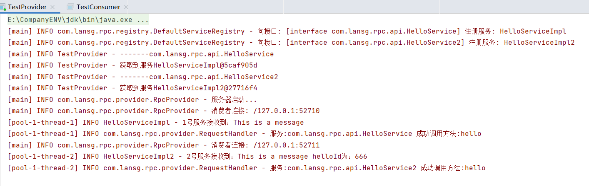
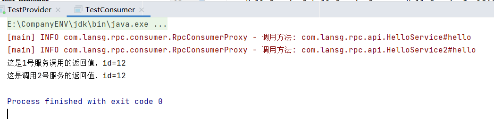

### 多个服务注册实现思路

为了实现多个服务的注册与查找，我们需要一张服务注册表，也就是一个Map。注册服务其实就是将服务名称和对应的服务存入导Map中。

首先我们创建一个服务注册表的通用接口，其中主要包括两个方法：`register方法`将一个服务注册进注册表，`getService方法`根据服务名称获取服务实体。这里使用了一个Set判断服务是否注册，如果服务已经注册则直接返回。

```java
public interface ServiceRegistry {
    /**
     * @param service 待注册的服务实体
     * @param <T> 服务实体类
     * @return
    */
    <T> void register(T service);

    /**
     * @param serviceName 服务名称
     * @return 服务实体
    */
    Object getService(String serviceName);
}
```

接着创建一个默认的服务注册表`DefaultServiceRegistry`，来实现通用接口`ServiceRegistry`。

```java
@Slf4j
public class DefaultServiceRegistry implements ServiceRegistry{

    private final Map<String,Object> serviceMap = new ConcurrentHashMap<>();
    private final Set<String> registeredService = ConcurrentHashMap.newKeySet();

    @Override
    public synchronized <T> void register(T service) {
        //getCanonicalName()返回正常包含路径的类名:HelloServiceImpl
        String serviceName = service.getClass().getCanonicalName();
        if (registeredService.contains(serviceName)) return;
        registeredService.add(serviceName);
        //由于一个服务HelloServiceImpl是可以实现多个接口的，所以用一个数组来接收实现的接口
        Class<?>[] interfaces = service.getClass().getInterfaces();
        if (interfaces.length == 0){
            throw new RpcException(RpcError.SERVICE_NOT_IMPLEMENT_ANY_INTERFACE);
        }
        for (Class<?> i:interfaces){
            serviceMap.put(i.getCanonicalName(),service);
        }
        log.info("向接口: {} 注册服务: {}", interfaces, serviceName);
    }

    @Override
    public synchronized Object getService(String serviceName) {
        Object service = serviceMap.get(serviceName);
        if (service == null){
            throw new RpcException(RpcError.SERVICE_NOT_FOUND);
        }
        return service;
    }
}
```

之前在`WorkThread`中直接通过`invoke()`方法进行调用，这里对其进行完善，分离出一个方法调用的处理器`RequestHandler`和处理线程`RequestHandlerThread`，将方法的调用过程放在处理器中进行，我们在处理线程中通过不同的处理器就可以对方法进行不同的操作。

```java
@Slf4j
public class RequestHandler{

    public Object handle(RpcRequestBean rpcRequest,Object service){
        Object result = null;
        try {
            result = invokeTargetMethod(rpcRequest,service);
            log.info("服务:{} 成功调用方法:{}", rpcRequest.getInterfaceName(), rpcRequest.getMethodName());
        } catch (InvocationTargetException | IllegalAccessException | ClassNotFoundException e) {
            log.error("调用或发送时有错误发生:", e);
        }
        return  result;
    }

    private Object invokeTargetMethod(RpcRequestBean rpcRequest,Object service) throws IllegalAccessException, InvocationTargetException, ClassNotFoundException {
        Method method;
        try {
            method = service.getClass().getMethod(rpcRequest.getMethodName(), rpcRequest.getParamTypes());
        } catch (NoSuchMethodException e) {
            return RpcResponseBean.fail(ResponseCode.METHOD_NOT_FOUND);
        }
        return method.invoke(service, rpcRequest.getParameters());
    }
}
```

```java
public class RequestHandlerThread implements Runnable{

    private Socket socket;
    private RequestHandler requestHandler;
    private ServiceRegistry serviceRegistry;

    public RequestHandlerThread(Socket socket,RequestHandler requestHandler, ServiceRegistry serviceRegistry){
        this.socket = socket;
        this.requestHandler = requestHandler;
        this.serviceRegistry = serviceRegistry;
    }

    @Override
    public void run() {
        try (ObjectInputStream objectInputStream = new ObjectInputStream(socket.getInputStream());
             ObjectOutputStream objectOutputStream = new ObjectOutputStream(socket.getOutputStream())){
            RpcRequestBean rpcRequest = (RpcRequestBean) objectInputStream.readObject();
            String interfaceName = rpcRequest.getInterfaceName();
            Object service = serviceRegistry.getService(interfaceName);
            Object result = requestHandler.handle(rpcRequest,service);
            objectOutputStream.writeObject(RpcResponseBean.success(result));
            objectOutputStream.flush();
        }catch (IOException | ClassNotFoundException e){
            log.error("调用或发送时有错误发生：", e);
        }
    }
}
```

然后增加一个`HelloService2`接口进行多个服务注册的测试

```java
public interface HelloService2 {
    String hello(HelloObject obj,int helloId);
}
```

`Provider`测试类如下

```java
public class TestProvider {
    public static void main(String[] args) {
        HelloService helloService = new HelloServiceImpl();
        HelloService2 helloService2 = new HelloServiceImpl2();
        ServiceRegistry serviceRegistry = new DefaultServiceRegistry();
        serviceRegistry.register(helloService);
        serviceRegistry.register(helloService2);
        Class<?>[] s = helloService.getClass().getInterfaces();
        Class<?>[] s2 = helloService2.getClass().getInterfaces();
        for (Class<?> i:s){
            log.info("-------{}",i.getName());
            Object o = serviceRegistry.getService(i.getCanonicalName());
            log.info("获取到服务{}",o);
        }
        for (Class<?> i:s2){
            log.info("-------{}",i.getName());
            Object o = serviceRegistry.getService(i.getCanonicalName());
            log.info("获取到服务{}",o);
        }
        RpcProvider rpcProvider = new RpcProvider(serviceRegistry);
        rpcProvider.start(9000);
    }
}
```

`Consumer`测试类如下：

```java
public class TestConsumer {
    public static void main(String[] args) {
        RpcConsumerProxy proxy = new RpcConsumerProxy("127.0.0.1", 9000);
        HelloService helloService = proxy.getProxy(HelloService.class);
        HelloService2 helloService2 = proxy.getProxy(HelloService2.class);
        HelloObject object = new HelloObject(12, "This is a message");
        String res1 = helloService.hello(object);
        String res2 = helloService2.hello(object,666);
        System.out.println(res1);
        System.out.println(res2);
    }
}
```

输出结果如下：

`Provider:`



`Consumer:`

