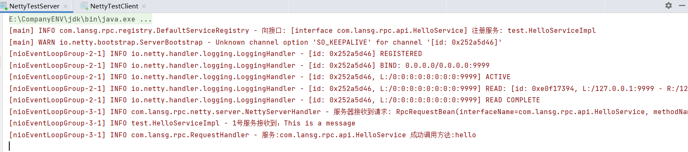
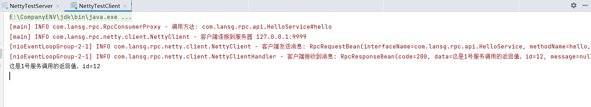

- 增加`PackageType`，用来表示序列化之后的信息是request还是response

```java
public enum PackageType {
    REQUEST_PACK(0),
    RESPONSE_PACK(1);

    private final int code;
}
```

- 增加`SerializerCode`，表示在字节流中标识系列化和反序列化器

```java
public enum SerializerCode {
    JSON(1);
    private final int code;
}
```

- 客户端将之前rpc-core/com.lansg.rpc/consumer下的`RpcConsumer`类改为了`RpcConsumer`接口，使得客户端可以有更多不同的实现方式：

```java
public interface RpcConsumer {
    Object sendRequest(RpcRequestBean rpcRequest);
}
```

- 服务端同样抽象出`RpcProvider`接口，其中包含启动服务的start（）方法：

```java
public interface RpcProvider {
    void start(int port);
}
```

- 定义一个通用的序列化和反序列化接口`CommonSerializer`：

```java
public interface CommonSerializer {
    //将对象序列化
    byte[] serialize(Object obj);
    //将对象反序列化
    Object deserialize(byte[] bytes, Class<?> clazz);

    int getCode();

    //如果code的值为1则创建一个Json格式的序列化器
    static CommonSerializer getByCode(int code) {
        switch (code) {
            case 1:
                return new JsonSerializer();
            default:
                return null;
        }
    }
}
```

- 创建Json格式的序列化器`JsonSerializer`，实现`CommonSerializer`接口

这里的序列化和反序列化使用了Jackson，Jackson是专门序列化和反序列化json的java开源框架，也是SpringMVC的默认json解析器。其中的`ObjectMapper`类可以从字符串、流或文件中解析json，并创建java对象来表示已解析的json。也可从java对象生成json，然后返回一个`String`或`Byte数组`的json。

```java
public class JsonSerializer implements CommonSerializer {
    private ObjectMapper objectMapper = new ObjectMapper();

    @Override
    public byte[] serialize(Object obj) {
            return objectMapper.writeValueAsBytes(obj);

    @Override
    public Object deserialize(byte[] bytes, Class<?> clazz) {
            Object obj = objectMapper.readValue(bytes, clazz);
            if(obj instanceof RpcRequestBean) {
                obj = handleRequest(obj);
            }
            return obj;
    }

    /*
        这里由于使用JSON序列化和反序列化Object数组，无法保证反序列化后仍然为原实例类型
        需要重新判断处理
     */
    private Object handleRequest(Object obj) throws IOException {
        RpcRequestBean rpcRequest = (RpcRequestBean) obj;
        for(int i = 0; i < rpcRequest.getParamTypes().length; i ++) {
            Class<?> clazz = rpcRequest.getParamTypes()[i];
            if(!clazz.isAssignableFrom(rpcRequest.getParameters()[i].getClass())) {
                byte[] bytes = objectMapper.writeValueAsBytes(rpcRequest.getParameters()[i]);
                rpcRequest.getParameters()[i] = objectMapper.readValue(bytes, clazz);
            }
        }
        return rpcRequest;
    }

    @Override
    public int getCode() {
        return SerializerCode.valueOf("JSON").getCode();
    }
}
```


- 实现通用的编码拦截器`CommonEncoder`，这个类继承了Netty中的`MessageToByteEncoder`类，主要的目的是**将序列化后的对象转为字节流发送出去**。

先将数据写入到buffer中，然后通过flush（）方法发送出去。

```java
public class CommonEncoder extends MessageToByteEncoder {

    private static final int MAGIC_NUMBER = 0xCAFEBABE;

    private final CommonSerializer serializer;

    @Override
    protected void encode(ChannelHandlerContext ctx, Object msg, ByteBuf out) throws Exception {
        out.writeInt(MAGIC_NUMBER);
        if(msg instanceof RpcRequest) {
            out.writeInt(PackageType.REQUEST_PACK.getCode());
        } else {
            out.writeInt(PackageType.RESPONSE_PACK.getCode());
        }
        out.writeInt(serializer.getCode());
        byte[] bytes = serializer.serialize(msg);
        out.writeInt(bytes.length);
        out.writeBytes(bytes);
    }

}
```

- 同样实现解码拦截器`CommonDecoder`，它继承了Netty中的`ReplayingDecoder`，而`ReplayingDecoder`又是`ByteToMessageDecoder`的子类，用来实现用户自定义的解码。

**decode（）过程基于客户端和服务端的传输协议。**

```java
public class CommonDecoder extends ReplayingDecoder {

    private static final int MAGIC_NUMBER = 0xCAFEBABE;

    @Override
    protected void decode(ChannelHandlerContext channelHandlerContext, ByteBuf in, List<Object> out) throws Exception {
        int magic = in.readInt();
        if (magic!=MAGIC_NUMBER){
            log.info("不识别的协议包:{}",magic);
            throw new RpcException(RpcError.UNKNOWN_PROTOCOL);
        }
        int packageCode = in.readInt();
        Class<?> packageClass;
        if(packageCode == PackageType.REQUEST_PACK.getCode()) {
            packageClass = RpcRequestBean.class;
        } else if(packageCode == PackageType.RESPONSE_PACK.getCode()) {
            packageClass = RpcResponseBean.class;
        } else {
            log.error("不识别的数据包: {}", packageCode);
            throw new RpcException(RpcError.UNKNOWN_PACKAGE_TYPE);
        }
        int serializerCode = in.readInt();
        CommonSerializer serializer = CommonSerializer.getByCode(serializerCode);
        if(serializer == null) {
            log.error("不识别的反序列化器: {}", serializerCode);
            throw new RpcException(RpcError.UNKNOWN_SERIALIZER);
        }
        int length = in.readInt();
        byte[] bytes = new byte[length];
        in.readBytes(bytes);
        Object obj = serializer.deserialize(bytes, packageClass);
        out.add(obj);
    }
}
```


- 创建Netty客户端`NettyClient`类，实现`RpcClient`接口，重写其中的`sendRequest()`方法

- 创建Netty服务端`NettyServer`类，实现`RpcServer`接口，重写其中的`start()`方法

因为之前的rpc-core/com.lansg.rpc/consumer/下的`RpcConsumer`和/provider/下的`RpcProvider`是通过socket实现传输的，这里为了区别socket和netty，将`RpcConsumer`更名为`SocketClient`，将`RpcProvider`更名为`SocketServer`，其功能不变。

最后通过测试类进行测试，测试结果如下：

`NettyTestServer`



`NettyTestClient`

